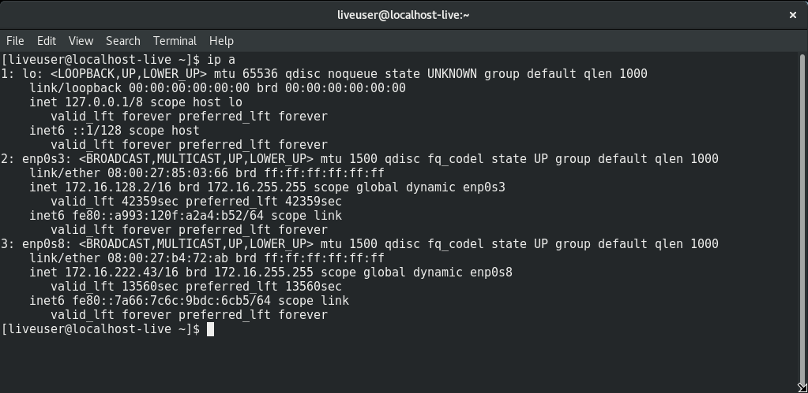

# Enterprise Linux Lab Report Task 04 - DHCP

- Student name: Siebert Timmermans
- Github repo: <https://github.com/HoGentTIN/elnx-sme-SiebertT>

Goal is to learn to configure DHCP with the subnets when being provided with ranges.

## Test plan Task 04 - DHCP

- Execute `vagrant status`
- Execute `vagrant up pr001`
- Log in to the server with `vagrant ssh pr001`
- Execute `sudo yum install nmap`
- Test DHCP functionality by typing `sudo nmap --script broadcast-dhcp-discover -e enp0s8`. You need to get a response and see the configured settings in the dhcp discover frame.
- Test DHCP IP allocation by setting up a workstation and checking the IPs provided to the interfaces


## Procedure/Documentation Task 04 - DHCP
My documentation and code is written down in the [cheat sheet](https://github.com/HoGentTIN/elnx-sme-SiebertT/blob/master/report/Task%2004%20DHCP/cheat-sheet%20DHCP.md)

For this task, the following steps were taken:

1. Download the required role (**DHCP**) and add it to the roles folder in the Ansible folder
2. Add the roles to **site.yml**
3. Add **pr001** to the **vagrant host** file
4. Add **pr001** to the **host_vars** file
5. Configure DHCP with the following
  6. Add the code to install the downloaded DHCP package and allow the firewall to pass the DHCP services
  7. Set the global domain name
  8. Set the global DNS servers, to access the internet outside of the internal network
  9. Configure the DHCP subnets
    10. Set the IP of the subnet and its netmask
    11. set the DNS forwarding server for the internal Network
    12. set the maximum lease time in this subnets
    13. Set up the DHCP pool
      14. Set the lease time for this specific pool
      15. Set the begin range for the pool
      16. Set the end range for the pool
      17. Allow unknown clients, so it is accessible to workstations
  18. Set the static DHCP per host, with its MAC and IP address
10. Test with nmap
11. Set up a workstation (documented in [cheat sheet](https://github.com/HoGentTIN/elnx-sme-SiebertT/blob/master/report/Task%2004%20DHCP/cheat-sheet%20DHCP.md)) and test the DHCP server IP allocation


> In order to get the names and syntax of the variables right, check the role documentation carefully


## Test report Task 04 - DHCP

### nmap through SSH

```
$ vagrant ssh pr001
Last login: Tue Jan 24 11:36:15 2017 from 10.0.2.2
Welcome to pr001..
enp0s3     : 10.0.2.15         fe80::a00:27ff:fe8e:91e0/64
enp0s8     : 172.16.0.2        fe80::a00:27ff:fe32:7ccc/64
[vagrant@pr001 ~]$ sudo nmap --script broadcast-dhcp-discover -e enp0s8

Starting Nmap 6.40 ( http://nmap.org ) at 2017-08-16 13:13 UTC
Pre-scan script results:
| broadcast-dhcp-discover:
|   IP Offered: 172.16.222.42
|   DHCP Message Type: DHCPOFFER
|   Server Identifier: 172.16.0.2
|   IP Address Lease Time: 0 days, 0:05:00
|   Subnet Mask: 255.255.0.0
|   Domain Name Server: 192.0.2.10, 192.0.2.11
|_  Domain Name: avalon.lan
WARNING: No targets were specified, so 0 hosts scanned.
Nmap done: 0 IP addresses (0 hosts up) scanned in 1.07 seconds
[vagrant@pr001 ~]$


```

### Workstation DHCP allocation test
#### Dynamic IP allocated from pool


#### Static IP allocated


#### `ip a` output



## Resources

https://github.com/bertvv/ansible-role-dhcp

https://nmap.org/nsedoc/scripts/dhcp-discover.html

[syllabus](https://chamilo.hogent.be/Chamilo/Libraries/Resources/Javascript/Plugin/PDFJS/web/viewer.html?file=https%3A%2F%2Fchamilo.hogent.be%2Findex.php%3Fapplication%3DChamilo%255CCore%255CRepository%26go%3DDocumentDownloader%26object%3D2327320%26security_code%3D24ed8910204771c621e8dae1f7cbad0e2148b8bc%26display%3D1)
