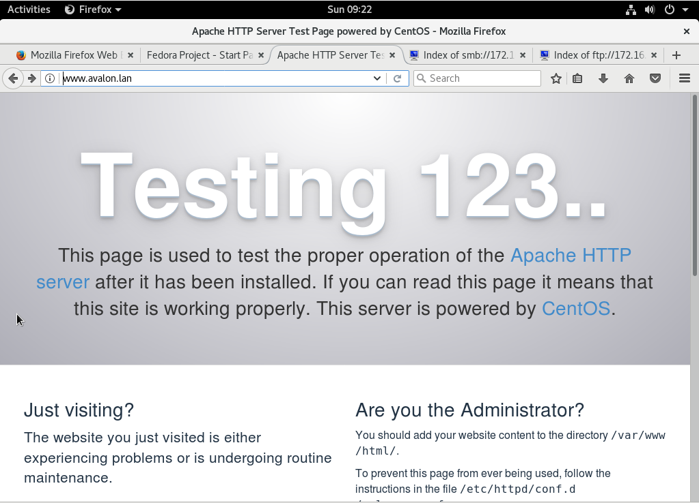
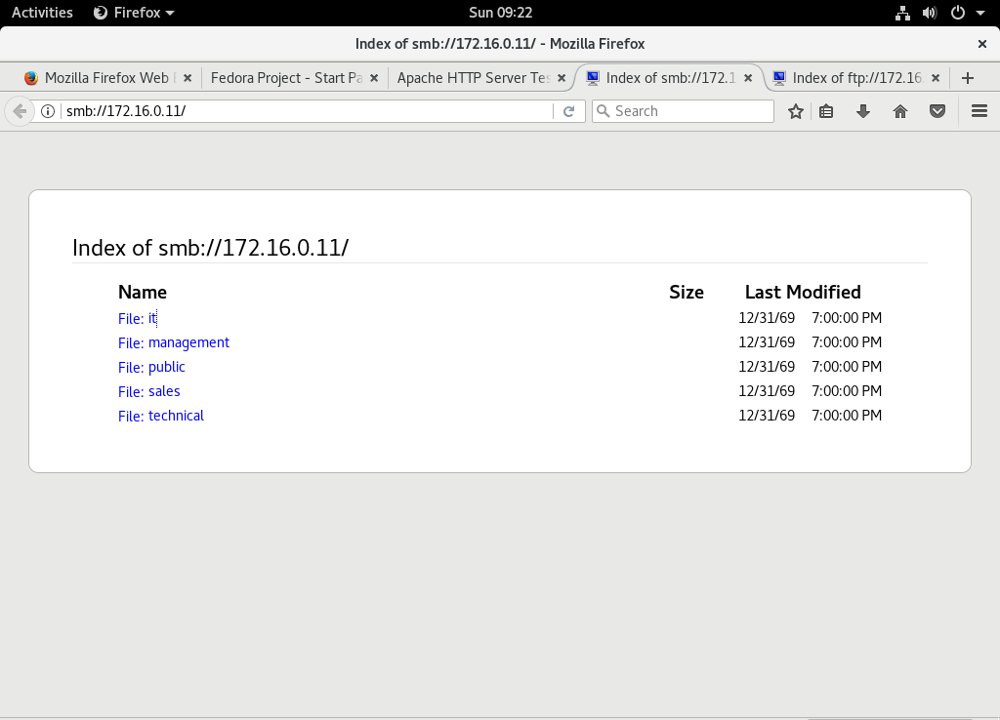

# Enterprise Linux Lab Report Task 04 - DHCP

- Student name: Siebert Timmermans
- Github repo: <https://github.com/HoGentTIN/elnx-sme-SiebertT>

Goal is to learn to configure DHCP with the subnets when being provided with ranges.

## Test plan Task 04 - DHCP

- Execute `vagrant status`
- Execute `vagrant up router`
- Set up a VM Workstation with VirtualBox as described [here](https://github.com/HoGentTIN/elnx-sme-SiebertT/blob/master/report/Task%2004%20Router/cheat-sheet%20Router.md#set-up-test-environment-with-virtualbox)
- Log in to the server with `vagrant ssh router`
- Test IP, Routing and DNS setup by executing: vagrant@r001:~$ `curl icanhazip.com`, this HTTP request should return an IP address
- Test the Router forwards and answers to DNS requests outside of the network with `nslookup icanhazip.com`, `nslookup icanhazip.com 192.0.2.254` and `nslookup icanhazip.com 172.16.255.254`. You should receive an answer for all of them.
- Start up the workstation and open the internet browser, there should be general internet
- Surf to `avalon.lan` you should see an Apache default welcome page
6. Enter `smb://172.16.0.11/` in the browser. You should see the shares from SAMBA
7. Enter `ftp://172.16.0.11/` in the browser. You should be prompted for login. Log in with credentials and check if the policies are in place by accessing the shares. If you log in with the admin _Siebert_ you should be able to access all shares except for the 'Management' share.


## Procedure/Documentation Task 03 - Fileshare
My documentation and code is written down in the [cheat sheet](https://github.com/HoGentTIN/elnx-sme-SiebertT/blob/master/report/Task%2004%20Router/cheat-sheet%20Router.md)

For this task, the following steps were taken:

1. Adding the VyOS Router initialisation code to the Vagrantfile
2. Updating the playbook.win script so that Ansible is not loaded. The configuration is provided by the router-config.sh script.
3. Adding the router to the BIND zone hosts in pu001
4. Configuration of the router-config.sh script
5. Configure DHCP with the following
  6. Set the basic settings such as the **host-name**, the **domain** and the **ssh port**
  7. Set the **IP Settings for each interface** with the correct address and description
  8. Set the NAT Rules, the internal network must be able to reach the DMZ and the internet
  9. Set up the NTP server to sync the time for Brussels in the EU zone.
  10. Set up the DNS Forwarding for the router. DNS requests for avalon.lan are forwarded to the DNS server pu001. All other DNS requests are forwarded to the ISP.
11. Test the configuration with the commands from the test plan
11. Set up a workstation (documented in [cheat sheet](https://github.com/HoGentTIN/elnx-sme-SiebertT/blob/master/report/Task%2004%20Router/cheat-sheet%20Router.md#set-up-test-environment-with-virtualbox) and test internet and intranet through the browser.


> As there were a lot of troubleshooting and trial and error in the configuration of the router,  extra documentation has been written in the [Task 04 Router folder](https://github.com/HoGentTIN/elnx-sme-SiebertT/tree/master/report/Task%2004%20Router).


## Test report Task 04 - DHCP

### Starting vagrant up and setting up the workstation

- Execute `vagrant status`
- Execute `vagrant up router`
- Set up a VM Workstation with VirtualBox as described. See [the setup in the cheat sheet](https://github.com/HoGentTIN/elnx-sme-SiebertT/blob/master/report/Task%2004%20Router/cheat-sheet%20Router.md#set-up-test-environment-with-virtualbox).
- Log in to the server with `vagrant ssh router`

```

siebs@SiebertsHomePC MINGW64 ~/Documents/Courses/EnterpriseLinux/elnx-sme-SiebertT (master)
$ vagrant status
Current machine states:

pu004                     running (virtualbox)
pu001                     running (virtualbox)
pu002                     running (virtualbox)
pr011                     running (virtualbox)
pr001                     running (virtualbox)
router                    not created (virtualbox)

This environment represents multiple VMs. The VMs are all listed
above with their current state. For more information about a specific
VM, run `vagrant status NAME`.

siebs@SiebertsHomePC MINGW64 ~/Documents/Courses/EnterpriseLinux/elnx-sme-SiebertT (master)
$ vagrant up router
Bringing machine 'router' up with 'virtualbox' provider...
==> router: Importing base box 'bertvv/vyos116'...
==> router: Matching MAC address for NAT networking...
==> router: Checking if box 'bertvv/vyos116' is up to date...
==> router: Setting the name of the VM: elnx-sme-SiebertT_router_1503248557790_7
933
==> router: Fixed port collision for 22 => 2222. Now on port 2204.
==> router: Clearing any previously set network interfaces...
==> router: Preparing network interfaces based on configuration...
    router: Adapter 1: nat
    router: Adapter 2: hostonly
    router: Adapter 3: hostonly
==> router: Forwarding ports...
    router: 22 (guest) => 2204 (host) (adapter 1)
==> router: Booting VM...
==> router: Waiting for machine to boot. This may take a few minutes...
    router: SSH address: 127.0.0.1:2204
    router: SSH username: vagrant
    router: SSH auth method: private key
==> router: Machine booted and ready!
==> router: Checking for guest additions in VM...
    router: The guest additions on this VM do not match the installed version of
    router: VirtualBox! In most cases this is fine, but in rare cases it can
    router: prevent things such as shared folders from working properly. If you
see
    router: shared folder errors, please make sure the guest additions within th
e
    router: virtual machine match the version of VirtualBox you have installed o
n
    router: your host and reload your VM.
    router:
    router: Guest Additions Version: 4.3.18
    router: VirtualBox Version: 5.1
==> router: Mounting shared folders...
    router: /vagrant => C:/Users/siebs/Documents/Courses/EnterpriseLinux/elnx-sm
e-SiebertT
==> router: Running provisioner: shell...
    router: Running: C:/Users/siebs/AppData/Local/Temp/vagrant-shell20170820-748
4-mttu0e.sh
==> router: >>> Running Ansible playbook /vagrant/ansible/site.yml locally on ho
st vyos.
==> router: ### On VyOS, not running Ansible here
==> router: Running provisioner: shell...
    router: Running: C:/Users/siebs/AppData/Local/Temp/vagrant-shell20170820-748
4-1pb0g71.sh
==> router:
==> router:   Nothing to delete (the specified node does not exist)
==> router:
==> router:   Configuration path: [service ssh port 22] already exists
==> router:
==> router:   Configuration path: [interfaces ethernet eth0 address dhcp] alread
y exists
==> router: [ system host-name r001 ]
==> router: Stopping enhanced syslogd: rsyslogd
==> router: .
==> router: Starting enhanced syslogd: rsyslogd
==> router: .
==> router:
==> router: [ system time-zone Europe/Brussels ]
==> router: Stopping enhanced syslogd: rsyslogd
==> router: .
==> router: Starting enhanced syslogd: rsyslogd
==> router: .
==> router:
==> router: [ system ntp ]
==> router: Stopping NTP server: ntpd
==> router: .
==> router: Starting NTP server: ntpd
==> router: .
==> router: Saving configuration to '/config/config.boot'...
==> router: Done

siebs@SiebertsHomePC MINGW64 ~/Documents/Courses/EnterpriseLinux/elnx-sme-SiebertT (master)
$ vagrant ssh router
Linux vyos 3.13.11-1-amd64-vyos #1 SMP Wed Sep 3 20:04:22 UTC 2014 x86_64
Welcome to VyOS.
This system is open-source software. The exact distribution terms for
each module comprising the full system are described in the individual
files in /usr/share/doc/*/copyright.
Last login: Sat Nov  8 09:21:55 2014 from 10.0.2.2
vagrant@r001:~$
```

### Testing IP routing and DNS setup
- Test IP, Routing and DNS setup by executing: vagrant@r001:~$ `curl icanhazip.com`, this HTTP request should return an IP address

```
vagrant@r001:~$ curl icanhazip.com
94.224.73.169
```

### Testing router DNS forwarding
- Test the Router DNS forwarding and answers to DNS requests outside of the network with `nslookup icanhazip.com`, `nslookup icanhazip.com 192.0.2.254` and `nslookup icanhazip.com 172.16.255.254`. You should receive an answer for all of them.

```
vagrant@r001:~$ nslookup icanhazip.com
Server:    10.0.2.3
Address 1: 10.0.2.3

Name:      icanhazip.com
Address 1: 64.182.208.183 icanhazip.com
Address 2: 64.182.208.184 icanhazip.com
Address 3: 64.182.208.182 icanhazip.com
Address 4: 64.182.208.181 icanhazip.com
Address 5: 2604:7780:200:305:f816:3eff:fe85:9193
Address 6: 2604:7780:200:305:f816:3eff:feac:9d7b
Address 7: 2604:7780:200:305:f816:3eff:feed:6179
Address 8: 2604:7780:200:305:f816:3eff:fedd:566c
vagrant@r001:~$ nslookup icanhazip.com 192.0.2.254
Server:    192.0.2.254
Address 1: 192.0.2.254

Name:      icanhazip.com
Address 1: 64.182.208.182 icanhazip.com
Address 2: 64.182.208.181 icanhazip.com
Address 3: 64.182.208.183 icanhazip.com
Address 4: 64.182.208.184 icanhazip.com
Address 5: 2604:7780:200:305:f816:3eff:fe85:9193
Address 6: 2604:7780:200:305:f816:3eff:feac:9d7b
Address 7: 2604:7780:200:305:f816:3eff:fedd:566c
Address 8: 2604:7780:200:305:f816:3eff:feed:6179
vagrant@r001:~$ nslookup icanhazip.com 172.16.255.254
Server:    172.16.255.254
Address 1: 172.16.255.254

Name:      icanhazip.com
Address 1: 64.182.208.182 icanhazip.com
Address 2: 64.182.208.181 icanhazip.com
Address 3: 64.182.208.183 icanhazip.com
Address 4: 64.182.208.184 icanhazip.com
Address 5: 2604:7780:200:305:f816:3eff:fe85:9193
Address 6: 2604:7780:200:305:f816:3eff:feac:9d7b
Address 7: 2604:7780:200:305:f816:3eff:feed:6179
Address 8: 2604:7780:200:305:f816:3eff:fedd:566c
vagrant@r001:~$

```

### Testing through workstation
- Start up the workstation and open the internet browser, there should be general internet


- Surf to `avalon.lan` you should see an Apache default welcome page




#### SMB and FTP testing
6. Enter `smb://172.16.0.11/` in the browser. You should see the shares from SAMBA
7. Enter `ftp://172.16.0.11/` in the browser. You should be prompted for login. Log in with credentials and check if the policies are in place by accessing the shares. If you log in with the admin _Siebert_ you should be able to access all shares except for the 'Management' share.





## Resources

https://wiki.vyos.net/wiki/User_Guide

https://github.com/bertvv/cheat-sheets/blob/master/src/VyOS.md

[syllabus](https://chamilo.hogent.be/Chamilo/Libraries/Resources/Javascript/Plugin/PDFJS/web/viewer.html?file=https%3A%2F%2Fchamilo.hogent.be%2Findex.php%3Fapplication%3DChamilo%255CCore%255CRepository%26go%3DDocumentDownloader%26object%3D2327320%26security_code%3D24ed8910204771c621e8dae1f7cbad0e2148b8bc%26display%3D1)
