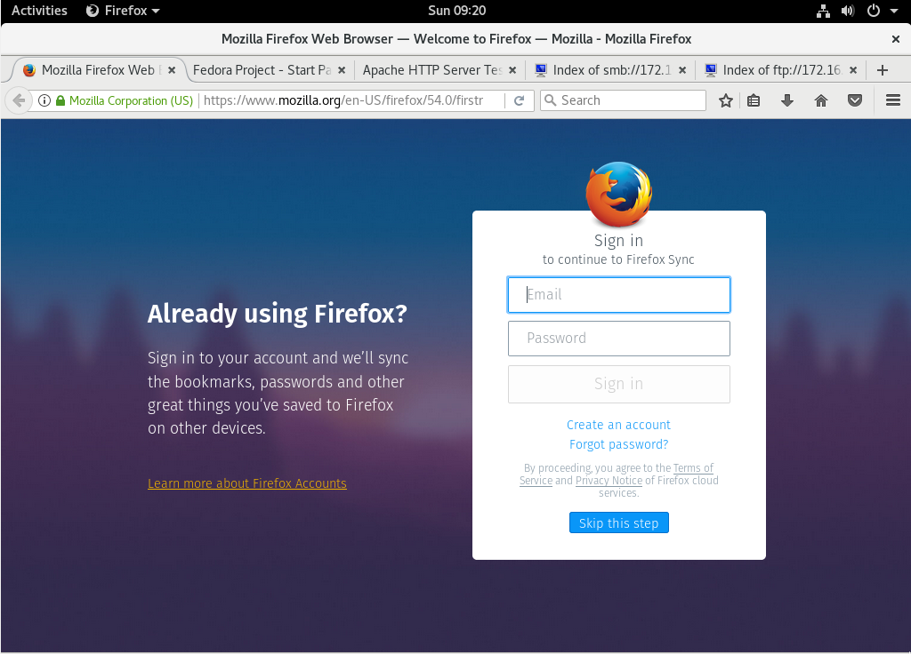
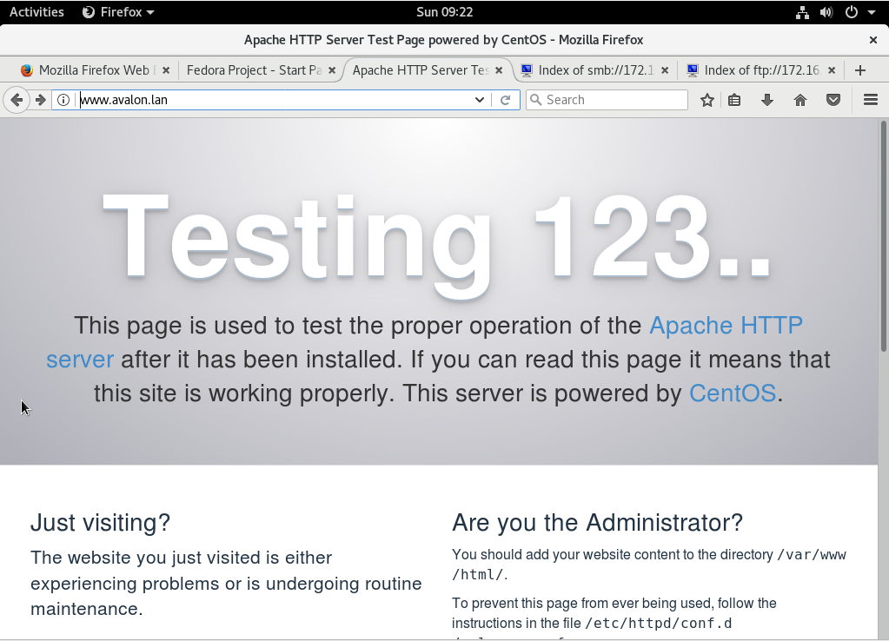
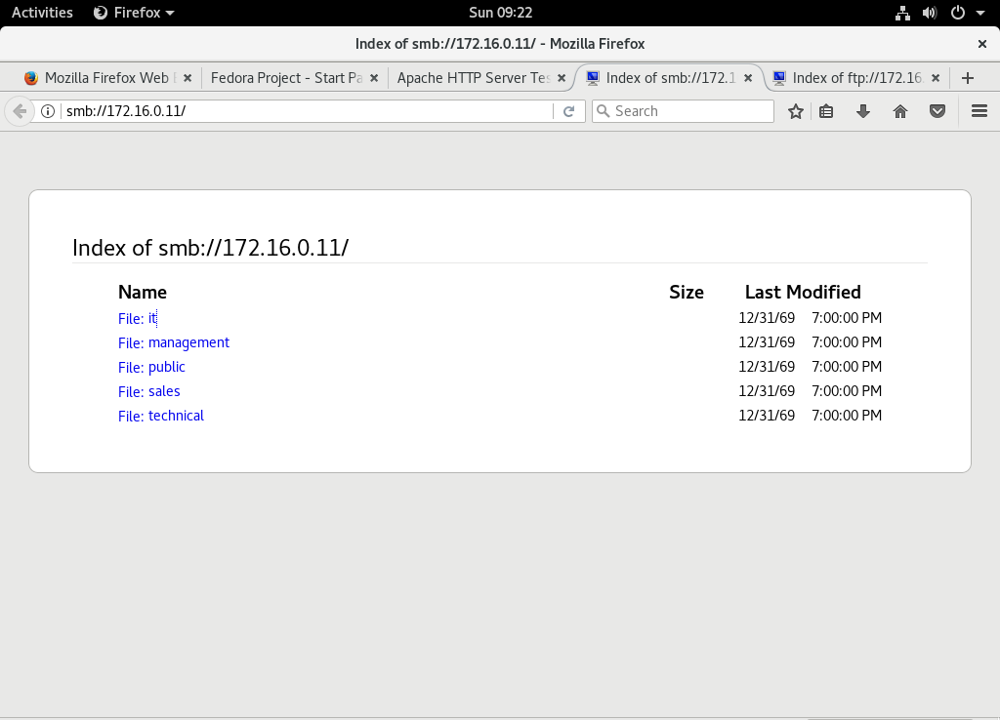

# Cheat sheets and checklists Router task 04

- Student name: [Siebert Timmermans](https://github.com/SiebertT)
- Github repo: [elnx-sme-SiebertT](https://github.com/HoGentTIN/elnx-sme-SiebertT)

## Basic commands

| Task                | Command |
| :---                | :---    |
| Query IP-adress(es) | `ip a`  |

## Git workflow

Simple workflow for a personal project without other contributors:

| Task                                         | Command                   |
| :---                                         | :---                      |
| Current project status                       | `git status`              |
| Select files to be committed                 | `git add FILE...`         |
| Commit changes to local repository           | `git commit -m 'MESSAGE'` |
| Push local changes to remote repository      | `git push`                |
| Pull changes from remote repository to local | `git pull`                |

## Checklist network configuration

1. Is the IP-adress correct? `ip a`
2. Is the router/default gateway correct? `ip r -n`
3. Is a DNS-server available? `cat /etc/resolv.conf`

## Add code to Vagrantfile to set up VyosOS
```
  # VyOS Router
  config.vm.define 'router' do |router|
    router.vm.box = 'bertvv/vyos116'
    router.vm.network :private_network,
      ip: '192.0.2.254',
      netmask: '255.255.255.0',
      auto_config: false
    router.vm.network :private_network,
      ip: '172.16.255.254',
      netmask: '255.255.0.0',
      auto_config: false
    router.ssh.insert_key = false

    router.vm.provision "shell" do |sh|
      sh.path = "scripts/router-config.sh"
    end
  end

  ```

## Check latest version of playbook.win script
Navigate to the playbook.win script in your repository.

Check for the latest version at:

https://github.com/HoGentTIN/elnx-sme/blob/master/scripts/playbook-win.sh

Update the script.

_It is necessary that ansible is not loaded when upping the router. All configuration for the router is provided by the router-config.sh script._

## Add the router to the BIND zone hosts in pu001
```
bind_zone_hosts:
<-------other hosts------->
  - name: r001
    ip: 192.0.2.254
    aliases:
      - gw
```

## Configure router-config.sh
In this VyOS configuration file we will be configuring the router to our needs. By setting up the variables in this file, there is no need to SSH into the router and configure anything.

A vagrant up will suffice.

### router-config configuration

```
#!/bin/vbash
source /opt/vyatta/etc/functions/script-template

configure

# Fix for error "INIT: Id "TO" respawning too fast: disabled for 5 minutes"
delete system console device ttyS0

#
# Basic settings
#
set system host-name r001 # sets host name to r001
set system domain-name 'avalon.lan' # sets domain-name to avalon.lan
set service ssh port '22' # sets ssh port to 22

#
# IP settings
# // sets eth0 interface as the WAN-LINK that gets its IP from the DHCP server
set interfaces ethernet eth0 address dhcp
set interfaces ethernet eth0 description "WAN link"

# sets the interface of the DMZ at eth1
set interfaces ethernet eth1 address 192.0.2.254/24
set interfaces ethernet eth1 description DMZ

# sets the interface of the internal LAN at eth2
set interfaces ethernet eth2 address 172.16.255.254/16
set interfaces ethernet eth2 description internal


#
# Network Address Translation
#


set nat source rule 200 outbound-interface 'eth1'
set nat source rule 200 translation address 'masquerade'
set nat source rule 200 source address '172.16.0.0/16'

set nat source rule 300 outbound-interface 'eth0'
set nat source rule 300 translation address 'masquerade'
set nat source rule 300 source address '172.16.0.0/16'

#
# Time
#
delete system ntp server 0.pool.ntp.org # Deletes old ntp servers that would remain after a provision
delete system ntp server 1.pool.ntp.org
delete system ntp server 2.pool.ntp.org
set system ntp server 'be.pool.ntp.org' # sets ntp server to the one for Belgium
set system time-zone Europe/Brussels # sets the time zone to EU/Brussels

#
# Domain Name Service
#
set service dns forwarding domain avalon.lan server 192.0.2.10 # sets the DNS forwarding domain and DNS server pu001
set service dns forwarding name-server 10.0.2.3 # sets the DNS of the IPS
# allows the eth1 and eth2 interfaces (the DMZ) to listen for DNS forwarding
set service dns forwarding listen-on 'eth1'
set service dns forwarding listen-on 'eth2'


# Make configuration changes persistent
commit
save

# Fix permissions on configuration
sudo chown -R root:vyattacfg /opt/vyatta/config/active

# vim: set ft=sh


```

## Set up test environment with VirtualBox

1. Set up a Linux distribution by adding an .ISO through the settings. In this case, a Fedora distribution is used
2. Navigate to the network settings of your newly created VM
3. Follow the DHCP setup configuration from [Cheat-sheet DHCP here](https://github.com/HoGentTIN/elnx-sme-SiebertT/blob/master/report/Task%2004%20DHCP/cheat-sheet%20DHCP.md#set-up-test-environment-with-virtualbox)
4. Open up the standard browser of your VM OS, for Fedora's case, this is Firefox
5. You should be welcomed by the default site of the browser, enter avalon.lan in the search bar, you should see the Apache welcoming screen
6. Enter `smb://172.16.0.11/` in the browser. This is the SMB configured from pr011.
7. Enter `ftp://172.16.0.11/` in the browser. This is the FTP configured from pr011. Access the files with your credentials.

Output should look like the following:











